# 🚀 HR Analytics Project – Employee Attrition Prediction

---

## 📌 1. Giới thiệu

Dự án xây dựng một **pipeline Machine Learning end-to-end** nhằm phân tích và dự đoán **nguy cơ nghỉ việc của nhân viên (Attrition)**.

### 🎯 Mục tiêu:
- 🔍 Phân tích hành vi nhân viên
- 🤖 Dự đoán khả năng nghỉ việc
- 📊 Trích xuất insight hỗ trợ HR

👉 Đây không chỉ là bài toán ML, mà là **Decision Support System cho HR**

---

## 📊 2. Dataset

- Nguồn: Kaggle HR Analytics  
- Kích thước ban đầu: **1480 × 38**  
- Sau xử lý: **1480 × 31**

### 📈 Phân bố Attrition:

| Label | Count | % |
|-------|-------|---|
| Stay (No) | 1242 | 84% |
| Leave (Yes) | 238 | 16% |

⚠️ Bài toán **mất cân bằng dữ liệu (imbalanced classification)**

---

## ⚙️ 3. Data Preprocessing

- Xử lý missing values  
- Encode categorical (LabelEncoder)  
- Chuẩn hóa dữ liệu (StandardScaler)  
- Xử lý imbalance:

```python
class_weight = 'balanced'
```

---

## 🧠 4. Feature Engineering

Tạo thêm 6 đặc trưng mới:

| Feature | Mô tả |
|---------|-------|
| `IncomePerYearExp` | Thu nhập theo năm kinh nghiệm |
| `CompanyTenureRatio` | Tỷ lệ thâm niên công ty |
| `SatisfactionIndex` | Chỉ số hài lòng tổng hợp |
| `PromotionGap` | Khoảng cách thăng tiến |
| `IncomeSalaryDiff` | Chênh lệch thu nhập |
| `ExternalExperience` | Kinh nghiệm bên ngoài |

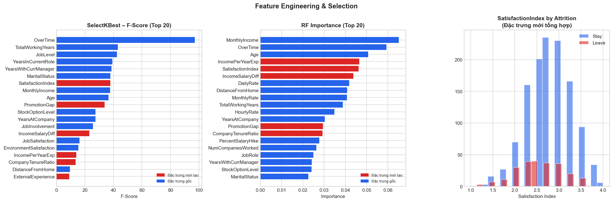

👉 Mục tiêu: biến dữ liệu thô → insight có ý nghĩa business

---

## 🔍 5. Feature Selection

Sử dụng **SelectKBest (ANOVA F-test)**

### 🔥 Top features:
- OverTime
- TotalWorkingYears
- JobLevel
- YearsInCurrentRole
- SatisfactionIndex
- MonthlyIncome

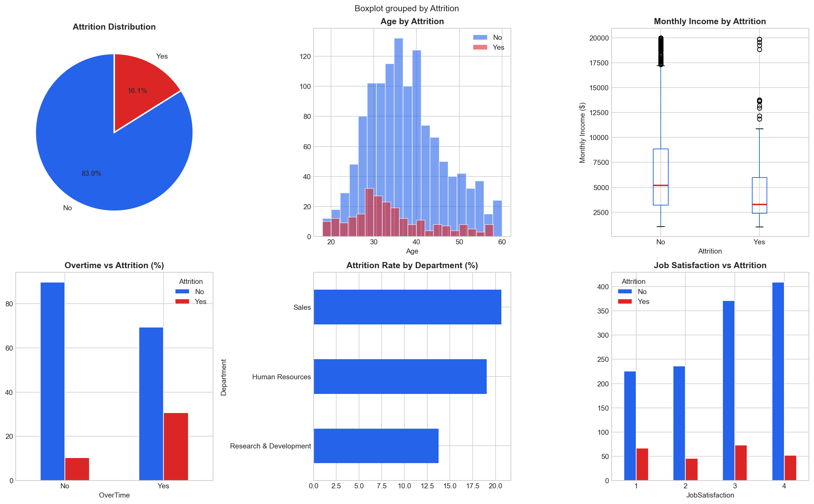

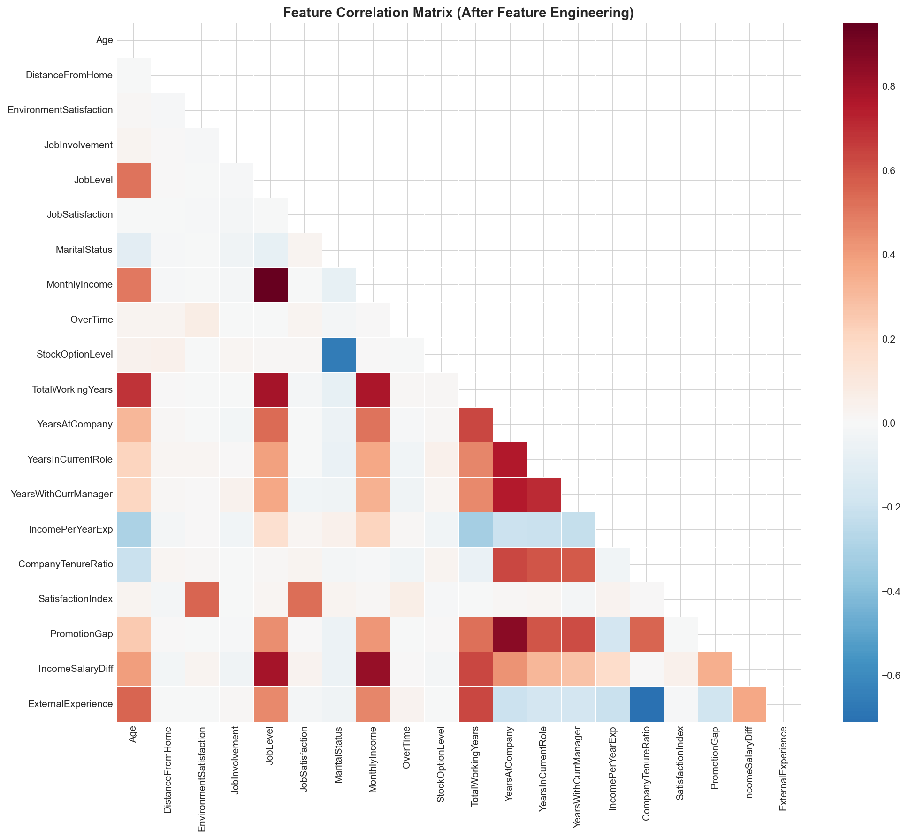

### 🎯 Insight:
> Nhân viên làm OT nhiều + ít thăng tiến → nguy cơ nghỉ việc cao

---

## 🧩 6. Clustering – Phân cụm nhân viên

Sử dụng **K-Means (k=4)**

### 📊 Kết quả:

| Cluster | Attrition Rate |
|---------|---------------|
| 0 | 10.5% |
| 1 | 11.1% |
| 2 | 9.0% |
| 3 | 🔥 22.0% |

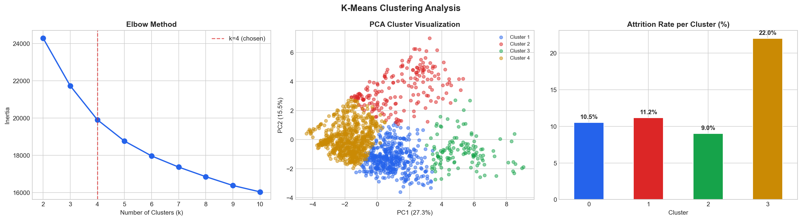

### 🎯 Insight:
> **Cluster 3** là nhóm rủi ro cao → cần ưu tiên giữ chân

---

## 🤖 7. Classification – Dự đoán nghỉ việc

### 📊 So sánh mô hình:

| Model | AUC | F1 (Leave) |
|-------|-----|------------|
| Logistic Regression | 0.8503 | ✅ **0.51** |
| Random Forest | 0.8616 | 0.39 |
| Gradient Boosting | **0.8716** | 0.41 |

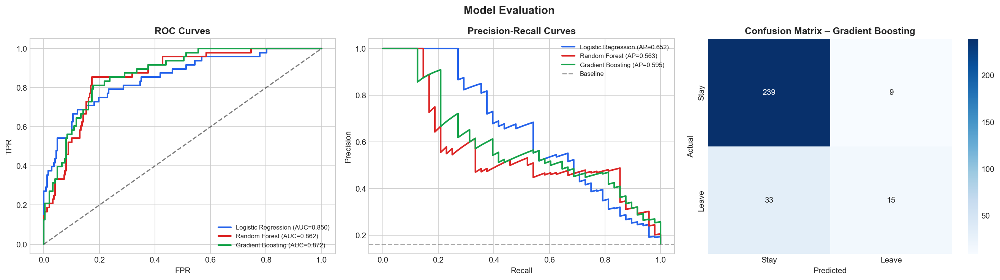

### 🎯 Kết luận:
- GBM có **AUC cao nhất**
- Logistic Regression có **F1 tốt nhất** cho lớp Leave

👉 **Chọn Logistic Regression**

---

## ⚙️ 8. Hyperparameters

| Model | Params |
|-------|--------|
| Logistic Regression | C=1.0, max_iter=1000 |
| Random Forest | n_estimators=200, max_depth=8 |
| Gradient Boosting | learning_rate=0.05, n_estimators=200 |

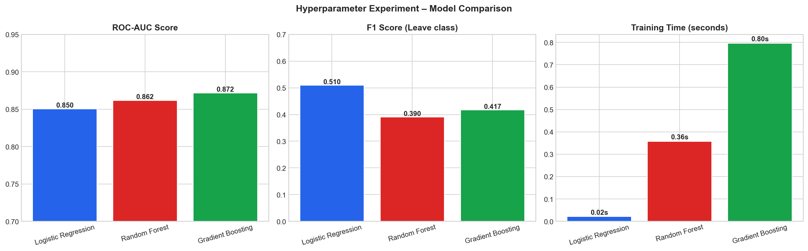

---

## 🧠 9. Model Explainability

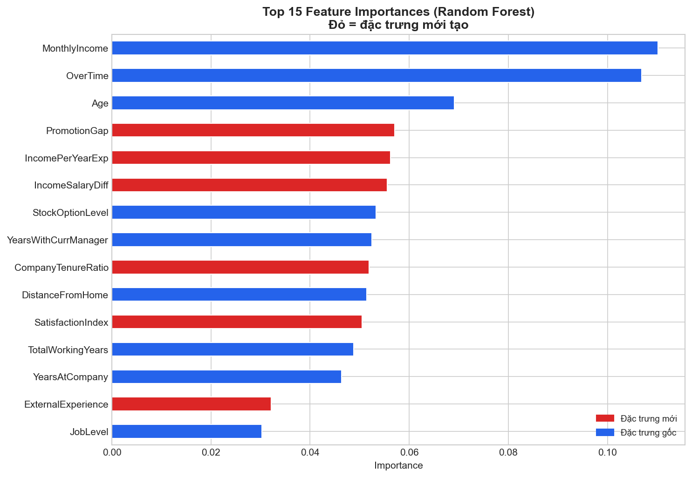

### 🔥 Top features:
1. OverTime
2. StockOptionLevel
3. SatisfactionIndex
4. MonthlyIncome
5. Age

### 🎯 Insight:
> **OverTime** là yếu tố ảnh hưởng mạnh nhất đến nghỉ việc

---

## 🔗 10. Association Rules (Apriori)

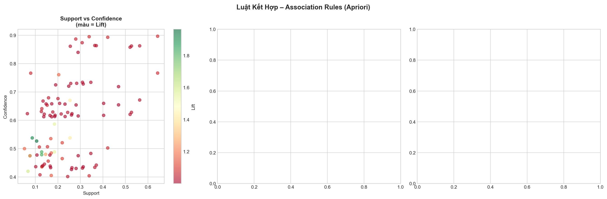

### 🔥 Ví dụ rules:
- `OT cao + lương thấp` → **nghỉ việc**
- `Lương cao` → **ở lại**

### 🎯 Ứng dụng:
- Rule-based alert system
- Hỗ trợ HR quyết định

---

## 🔬 11. Semi-Supervised Learning

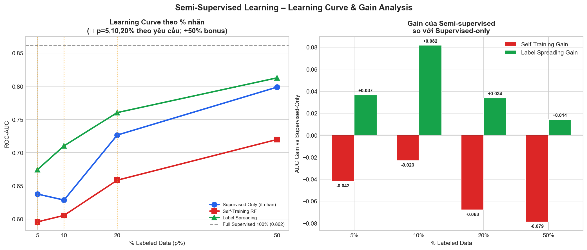

| Method | Hiệu quả |
|--------|----------|
| Self-Training | ❌ Bị bias |
| Label Spreading | ✅ Ổn định hơn |

---

## 📉 12. Regression – Job Satisfaction

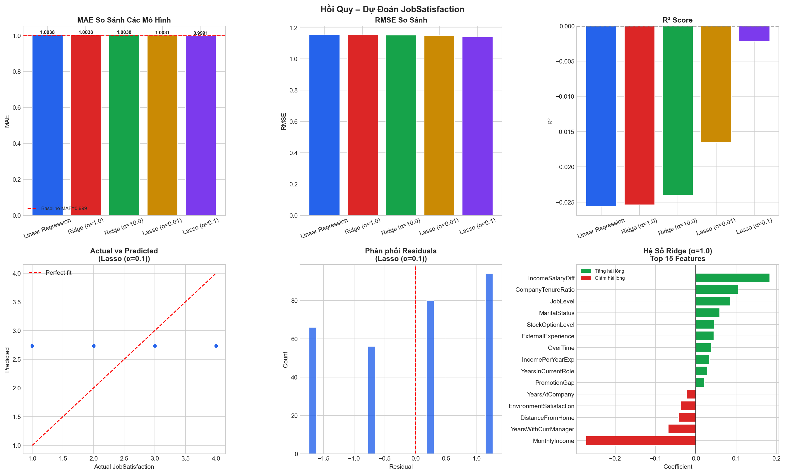

### 📊 Kết quả: R² ≈ 0

### 🎯 Insight:
> Job Satisfaction **khó dự đoán** → phụ thuộc yếu tố ẩn

---

## 🚨 13. Data Leakage

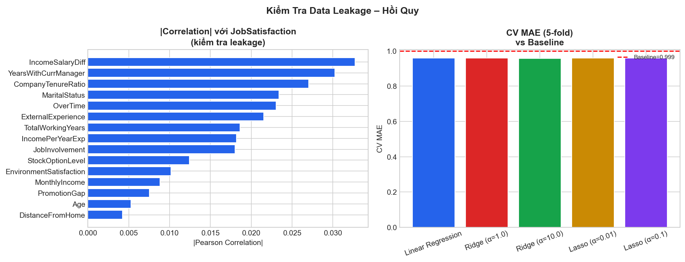

### Phát hiện:
- `SatisfactionIndex` gây leakage

👉 Đã loại bỏ để đảm bảo tính chính xác

---

## 📊 14. Tổng hợp biểu đồ

| Figure | Nội dung |
|--------|----------|
| fig0 | Feature Engineering |
| fig1 | EDA |
| fig2 | Correlation |
| fig3 | Clustering |
| fig4 | Model Evaluation |
| fig5 | Hyperparameters |
| fig6 | Feature Importance |
| fig7 | Semi-supervised |
| fig8 | Association Rules |
| fig9 | Model Explainability |
| fig10 | Regression |
| fig11 | Leakage Check |

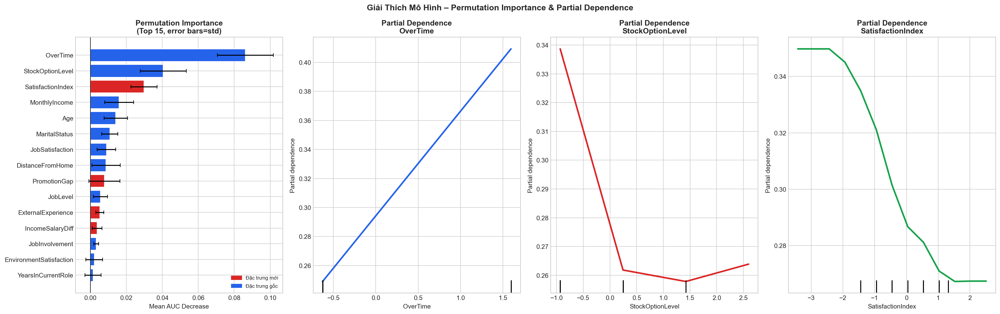

---

## 💡 15. Insight Business

Nhân viên dễ nghỉ việc khi:

- 🔥 Làm thêm giờ nhiều
- 💰 Lương thấp
- 📉 Ít thăng tiến
- 😞 Satisfaction thấp

---

## 🎯 16. Ứng dụng thực tế

- Dự đoán nhân viên nghỉ việc
- Dashboard HR
- Hệ thống cảnh báo sớm
- Cá nhân hóa giữ chân nhân viên

---

## 🛠️ 17. Tech Stack


- Python
- Pandas, NumPy
- Scikit-learn
- Matplotlib, Seaborn

---

## ▶️ 18. Cách chạy project

```bash
pip install -r requirements.txt
python hr_pipeline.py
```

---

## 📌 19. Kết luận

Hệ thống hoàn chỉnh gồm:

- ✅ Phân tích dữ liệu
- ✅ Dự đoán
- ✅ Giải thích
- ✅ Hỗ trợ quyết định

👉 Có thể mở rộng thành:
- Dashboard (Power BI / Streamlit)
- Web App
- HR Decision System